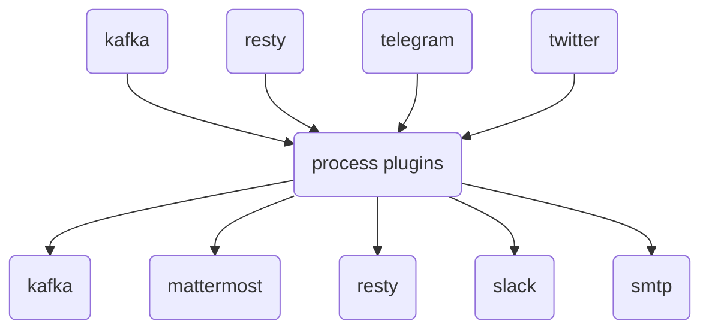

# gosquito

***gosquito*** ("go" + "mosquito") is a pluggable tool for data
gathering, data processing and data transmitting to various destinations. 
Main goal is to replace various in-house automated tasks with a single tool and move those tasks at the edge. See [docs](docs/README.md) for additional info.

 

### Main features:

* Pluggable architecture. Data processing organized as chains of plugins.
* Flow approach. Flow consists of: input plugin (receive), process plugins (filter/transform), output
  plugin (send).
* Declarative YAML configurations with templates support.
* Consider data as new by configurable signature (data timestamp by default). Force fetching is supported.
* Dependencies between process plugins. Plugin "B" will process data only if plugin "A" derived some data.
* Parallel executions limits. 
* Export metrics to [Prometheus](https://prometheus.io/).

 

### Input plugins:

| Plugin                                     | Description                                                                                    |
|:-------------------------------------------|:-----------------------------------------------------------------------------------------------|
| [kafka](docs/plugins/input/kafka.md)       | [Kafka](https://kafka.apache.org/) topics as data source.                                   |
| [resty](docs/plugins/input/resty.md)       | [REST](https://en.wikipedia.org/wiki/Representational_state_transfer) endpoint as data source. |
| [rss](docs/plugins/input/rss.md)           | [RSS/Atom](https://en.wikipedia.org/wiki/RSS) feed as data source.                             |
| [telegram](docs/plugins/input/telegram.md) | [Telegram](https://telegram.org/) chat as data source.                                         |
| [twitter](docs/plugins/input/twitter.md)   | [Twitter](https://twitter.com/) channel as data source.                                        |

### Process plugins:

| Plugin                                                 | Description                                                       |
|:-------------------------------------------------------|:------------------------------------------------------------------|
| [dedup](docs/plugins/process/dedup.md)                 | Deduplicate data items by UUID.                                   |
| [echo](docs/plugins/process/echo.md)                   | Echoing processing data.                                          |
| [expandurl](docs/plugins/process/expandurl.md)         | Expand short URLs.                                                |
| [fetch](docs/plugins/process/fetch.md)                 | Fetch remote data.                                                |
| [jq](docs/plugins/process/jq.md)                       | Extract JSON elements.                                            |
| [minio](docs/plugins/process/minio.md)                 | Put data to [S3](https://en.wikipedia.org/wiki/Amazon_S3) bucket. |
| [regexpfind](docs/plugins/process/regexpfind.md)       | Find patters in data.                                             |
| [regexpmatch](docs/plugins/process/regexpmatch.md)     | Match data by patterns.                                           |
| [regexpreplace](docs/plugins/process/regexpreplace.md) | Replace patterns in data.                                         |
| [resty](docs/plugins/process/resty.md)                 | Perform REST queries.                                             |
| [unique](docs/plugins/process/unique.md)               | Get unique values from data.                                      |
| [webchela](docs/plugins/process/webchela.md)           | Interact with web pages (Firefox and Chrome).                     |
| [xpath](docs/plugins/process/xpath.md)                 | Extract HTML elements.                                            |

### Output plugins:

| Plugin                                          | Description                                                                                   |
|:------------------------------------------------|:----------------------------------------------------------------------------------------------|
| [kafka](docs/plugins/output/kafka.md)           | Send data to [Kafka](https://kafka.apache.org/) topics.                                       |
| [mattermost](docs/plugins/output/mattermost.md) | Send data to [Mattermost](https://mattermost.org/) channels/users.                            |
| [resty](docs/plugins/output/resty.md)           | Send data to [REST](https://en.wikipedia.org/wiki/Representational_state_transfer) endpoints. |
| [slack](docs/plugins/output/slack.md)           | Send data to [Slack](https://slack.com) channels/users.                                       |
| [smtp](docs/plugins/output/smtp.md)             | Send data as email.                                                                           |

### ToDo:

0. prometheus: last message received timestamp.
1. credentials: add vault support.
2. prometheus: extend metrics with invalid flows.
3. core: cron mode.
4. regexp/ml: storage of interests.
5. input: match_ignore_case option for match_signature.
6. docs: add complex examples, docker compose environments.
7. telegram: add careful (api limits) support for download/sending unread files/messages.
8. telegram: message_type option for message filtering.
9. plugins: new (echo plugin more suitable?) file plugin for saving text to files.
