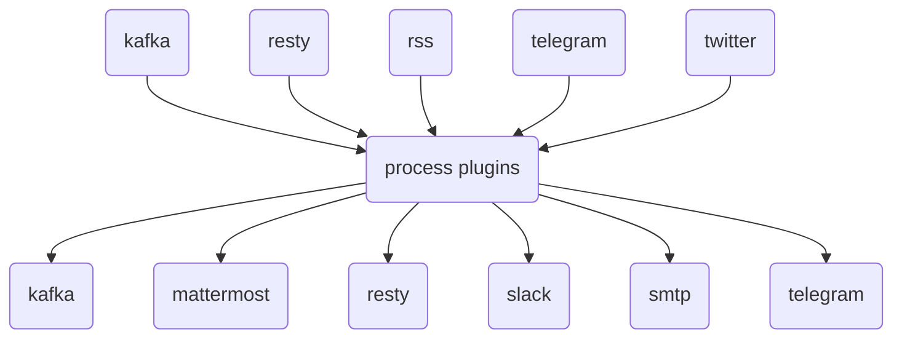

# gosquito

**_gosquito_** ("go" + "mosquito") is a pluggable tool for data
gathering, data processing and data transmitting to various destinations.
Main goal is to replace various in-house automated tasks with a single tool and move those tasks at the edge. See [docs](docs/README.md) and [examples](https://github.com/livelace/gosquito-public) for additional info.

 

### Main features:

- Pluggable architecture. Data processing organized as chains of plugins.
- Flow approach. Flow consists of: input plugin (receive), process plugins (filter/transform), output
  plugin (send).
- Declarative YAML configurations with templates support.
- Consider data as new by configurable signature (data timestamp by default). Force fetching is supported.
- Dependencies between process plugins. Plugin "B" will process data only if plugin "A" derived some data.
- Parallel executions limits.
- Export metrics to [Prometheus](https://prometheus.io/).

 

### Input plugins:

| Plugin                                     | Description                                                                                    |
| :----------------------------------------- | :--------------------------------------------------------------------------------------------- |
| [io](docs/plugins/input/io.md)             | Use text and files as data source.                                                             |
| [kafka](docs/plugins/input/kafka.md)       | [Kafka](https://kafka.apache.org/) topic as data source.                                       |
| [resty](docs/plugins/input/resty.md)       | [REST](https://en.wikipedia.org/wiki/Representational_state_transfer) endpoint as data source. |
| [rss](docs/plugins/input/rss.md)           | [RSS/Atom](https://en.wikipedia.org/wiki/RSS) feed as data source.                             |
| [telegram](docs/plugins/input/telegram.md) | [Telegram](https://telegram.org/) chat as data source.                                         |
| [twitter](docs/plugins/input/twitter.md)   | [Twitter](https://twitter.com/) channel as data source.                                        |

### Process plugins:

| Plugin                                                 | Description                                                                |
| :----------------------------------------------------- | :------------------------------------------------------------------------- |
| [dedup](docs/plugins/process/dedup.md)                 | Deduplicate datums by UUID.                                                |
| [echo](docs/plugins/process/echo.md)                   | Echoing processing data.                                                   |
| [expandurl](docs/plugins/process/expandurl.md)         | Expand short URLs.                                                         |
| [fetch](docs/plugins/process/fetch.md)                 | Fetch remote data.                                                         |
| [io](docs/plugins/process/io.md)                       | Read/write text and files.                                                 |
| [jq](docs/plugins/process/jq.md)                       | Extract JSON elements.                                                     |
| [minio](docs/plugins/process/minio.md)                 | Get/put data from/to [S3](https://en.wikipedia.org/wiki/Amazon_S3) bucket. |
| [regexpfind](docs/plugins/process/regexpfind.md)       | Find patters in data.                                                      |
| [regexpmatch](docs/plugins/process/regexpmatch.md)     | Match data by patterns.                                                    |
| [regexpreplace](docs/plugins/process/regexpreplace.md) | Replace patterns in data.                                                  |
| [resty](docs/plugins/process/resty.md)                 | Perform REST queries.                                                      |
| [same](docs/plugins/process/same.md)                   | Match data similarity.                                                     |
| [unique](docs/plugins/process/unique.md)               | Get unique values from data.                                               |
| [webchela](docs/plugins/process/webchela.md)           | Process web pages with full browser support (Chrome, Firefox).             |
| [xpath](docs/plugins/process/xpath.md)                 | Extract HTML elements.                                                     |

### Output plugins:

| Plugin                                          | Description                                                                                  |
| :---------------------------------------------- | :------------------------------------------------------------------------------------------- |
| [kafka](docs/plugins/output/kafka.md)           | Send data to [Kafka](https://kafka.apache.org/) topic.                                       |
| [mattermost](docs/plugins/output/mattermost.md) | Send data to [Mattermost](https://mattermost.org/) channel/user.                             |
| [resty](docs/plugins/output/resty.md)           | Send data to [REST](https://en.wikipedia.org/wiki/Representational_state_transfer) endpoint. |
| [slack](docs/plugins/output/slack.md)           | Send data to [Slack](https://slack.com) channel/user.                                        |
| [smtp](docs/plugins/output/smtp.md)             | Send data as email.                                                                          |
| [telegram](docs/plugins/output/telegram.md)     | Send data to [Telegram](https://telegram.org) chat.                                          |

### ToDo:

0. prometheus: last message received timestamp.
1. prometheus: extend metrics with invalid flows.
2. core: cron mode.
3. regexp/ml: storage of interests.
4. input: match_ignore_case option for match_signature.
5. docs: add complex examples, docker compose environments.
6. telegram: add careful (api limits) support for download/sending unread files/messages.
7. plugins: new (echo plugin more suitable?) file plugin for saving text to files.
8. core/ml: auto learning interval.
9. process: ocr plugin.
10. process: lang detect plugin.
11. core: file deduplication cache.
12. process: exec plugin.
13. core: top content ratio.
14. core: flow schedule.
15. kafka: warn about connection problems.
16. core: log level for flow.
17. core: flow enable/disable regexp support.
