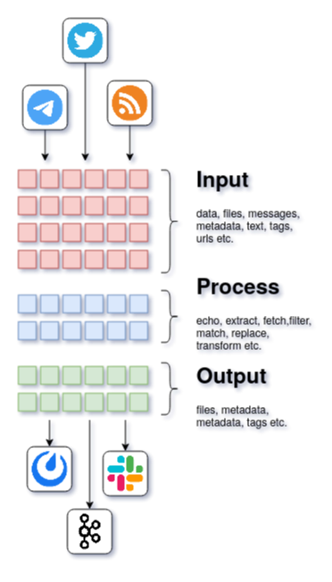

# gosquito

***gosquito*** ("go" + "mosquito") is a pluggable tool for data
gathering, data processing and data transmitting to various destinations. 
Main goal is to replace various in-house automated tasks with a single tool and move those tasks at the edge.

### Main features:

* Pluggable architecture. Data processing organized as chains of plugins.
* Flow approach. Flow consists of: input plugin (receive), process plugins (filter/transform), output
  plugin (send).
* Declarative YAML configurations with templates support.
* Consider data as new by configurable signature (data timestamp by default). Force fetching is supported.
* Dependencies between process plugins. Plugin "B" will process data only if plugin "A" derived some data.
* Parallel executions limits. 
* Export metrics to [Prometheus](https://prometheus.io/).

   
   
   

### Input plugins:

| Plugin                                                                                        | Description                                                                                      |
| :-------------------------------------------------------------------------------------------- | :------------------------------------------------------------------------------                  |
| [resty](https://github.com/livelace/gosquito/blob/master/docs/plugins/input/resty.md)         | [REST](https://en.wikipedia.org/wiki/Representational_state_transfer) endpoints as data sources. |
| [rss](https://github.com/livelace/gosquito/blob/master/docs/plugins/input/rss.md)             | [RSS/Atom](https://en.wikipedia.org/wiki/RSS) feeds data source.                                 |
| [telegram](https://github.com/livelace/gosquito/blob/master/docs/plugins/input/telegram.md)   | [Telegram](https://telegram.org/) chats (client API) data source.                                |
| [twitter](https://github.com/livelace/gosquito/blob/master/docs/plugins/input/twitter.md)     | [Twitter](https://twitter.com/) tweets data source.                                              |

### Process plugins:

| Plugin                                                                                                    | Description                                                                              |
| :-------------------------------------------------------------------------------------------------------- | :--------------------------------------------------------------------------------------- |
| [dedup](https://github.com/livelace/gosquito/blob/master/docs/plugins/process/dedup.md)                   | Deduplicate data items by UUID.                                                          |
| [echo](https://github.com/livelace/gosquito/blob/master/docs/plugins/process/echo.md)                     | Echoing processing data.                                                                 |
| [expandurl](https://github.com/livelace/gosquito/blob/master/docs/plugins/process/expandurl.md)           | Expand short URLs.                                                                       |
| [fetch](https://github.com/livelace/gosquito/blob/master/docs/plugins/process/fetch.md)                   | Fetch remote data.                                                                  |
| [jq](https://github.com/livelace/gosquito/blob/master/docs/plugins/process/jq.md)                         | Extract JSON elements.                                                                   |
| [minio](https://github.com/livelace/gosquito/blob/master/docs/plugins/process/minio.md)                   | Put data to [S3](https://en.wikipedia.org/wiki/Amazon_S3) bucket.                        |
| [regexpfind](https://github.com/livelace/gosquito/blob/master/docs/plugins/process/regexpfind.md)         | Find patters in data.                                                                    |
| [regexpmatch](https://github.com/livelace/gosquito/blob/master/docs/plugins/process/regexpmatch.md)       | Match data by patterns.                                                                  |
| [regexpreplace](https://github.com/livelace/gosquito/blob/master/docs/plugins/process/regexpreplace.md)   | Replace patterns in data.                                                                |
| [resty](https://github.com/livelace/gosquito/blob/master/docs/plugins/process/resty.md)                   | Perform REST queries.                                                                   |
| [unique](https://github.com/livelace/gosquito/blob/master/docs/plugins/process/unique.md)                 | Get unique values from data.                                                             |
| [webchela](https://github.com/livelace/gosquito/blob/master/docs/plugins/process/webchela.md)             | Interact with web pages (Firefox and Chrome).                                            |
| [xpath](https://github.com/livelace/gosquito/blob/master/docs/plugins/process/xpath.md)                   | Extract HTML elements.                                                                   |

### Output plugins:

| Plugin                                                                                             | Description                                                                                   |
| :------------------------------------------------------------------------------------------------- | :-------------------------------------------------------------------                          |
| [kafka](https://github.com/livelace/gosquito/blob/master/docs/plugins/output/kafka.md)             | Send data to [Kafka](https://kafka.apache.org/) topics.                                       |
| [mattermost](https://github.com/livelace/gosquito/blob/master/docs/plugins/output/mattermost.md)   | Send data to [Mattermost](https://mattermost.org/) channels/users.                            |
| [resty](https://github.com/livelace/gosquito/blob/master/docs/plugins/output/resty.md)             | Send data to [REST](https://en.wikipedia.org/wiki/Representational_state_transfer) endpoints. |
| [slack](https://github.com/livelace/gosquito/blob/master/docs/plugins/output/slack.md)             | Send data to [Slack](https://slack.com) channels/users.                                       |
| [smtp](https://github.com/livelace/gosquito/blob/master/docs/plugins/output/smtp.md)               | Send data as email.                                          |
